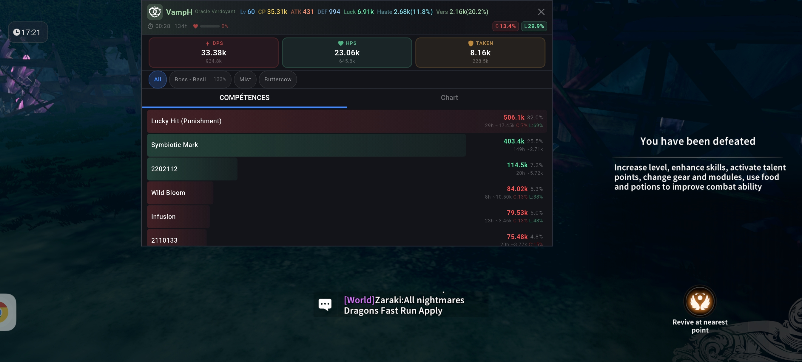
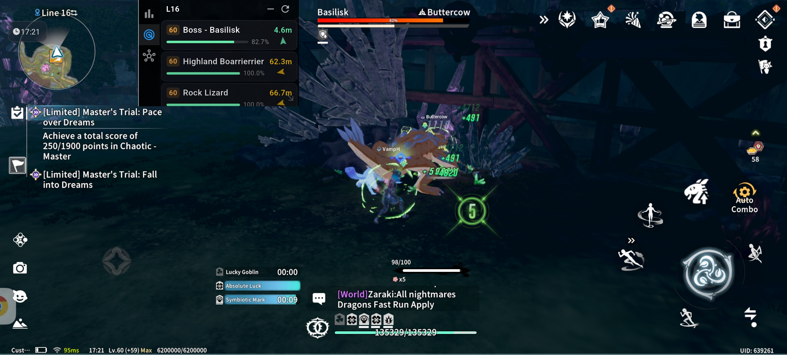
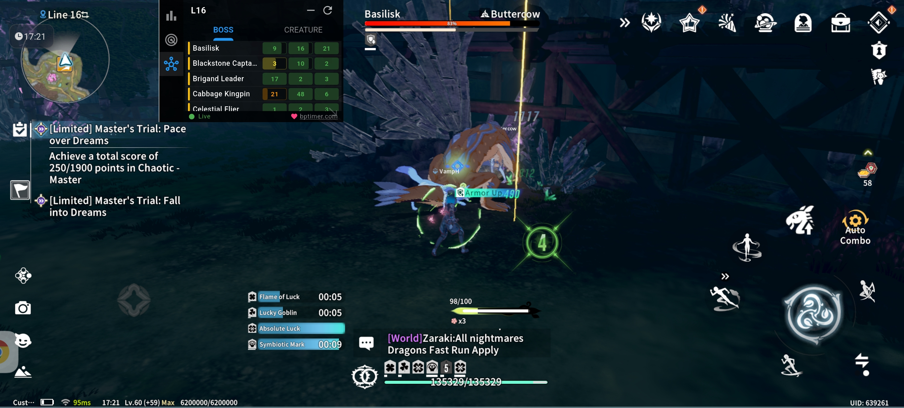

# BlueMeter — DPS Meter for Blue Protocol: Star Resonance

## Screenshots / Captures d'écran

<p float="left">
  
  
  
</p>

## Quick Links

- [Latest Release](https://github.com/jbourny/bluemetermobile/releases/latest)
- [Français](#français)
- [English](#english)

---

## Français

### Description

BlueMeter est un DPS/Heal meter mobile pour **Blue Protocol: Star Resonance**.
L'application affiche les informations de combat en temps réel via un overlay Android.

### Nouveautés — Version 1.1

- Meilleure prise en compte des données transmises par le jeu.
- Plus d'informations affichées sur l'écran de détail de DPS.
- Affichage d'une petite boussole pour les monstres à proximité *(peut encore ne pas fonctionner dans certains cas)*.
- Affichage du numéro de ligne.
- Affichage des HP par ligne pour Boss/Monstre grâce à **bptimer.com**.

### Fonctionnalités principales

- Overlay flottant avec DPS / Heal / Dégâts subis (instantané + total).
- Reset rapide des compteurs.
- Vue de détail DPS enrichie.
- Informations de proximité des monstres.

### Plateforme

- Android uniquement.
- iOS : non prévu à court terme (limitations d'overlay).

### Installation

1. Cloner le dépôt et ouvrir le projet Flutter.
2. Construire l'APK :

```bash
flutter build apk --release
```

3. Installer l'APK sur l'appareil Android.
4. Autoriser la permission d'affichage par-dessus les autres applications.

### Utilisation

- Lancer le jeu, puis BlueMeter.
- Vérifier que l'overlay est bien autorisé.
- Utiliser le bouton de reset si nécessaire.

### Dépannage rapide

- Overlay absent : vérifier les permissions "Afficher par-dessus les autres applis".
- Problème de déplacement de la fenêtre : redémarrer l'application.
- Boussole de proximité imprécise : fonctionnalité encore en amélioration.

### Contribution

- Les contributions (issues / PR) sont les bienvenues.

### Vie privée & sécurité

- Aucune donnée personnelle n'est collectée ni envoyée.

### Licence

- GNU Affero General Public License v3.

### Remerciements

- Merci au projet PC BlueMeter : https://github.com/caaatto/BlueMeter
- Merci à **bptimer.com** pour les données utilisées dans l'affichage HP par ligne : https://bptimer.com

### Soutien

- PayPal : https://paypal.me/JBourny

---

## English

### Description

BlueMeter is a mobile DPS/Heal meter for **Blue Protocol: Star Resonance**.
The app provides real-time combat information through an Android floating overlay.

### What's New — Version 1.1

- Better handling of game-transmitted data.
- More information on the DPS detail screen.
- Small compass for nearby monsters *(may still be unreliable in some situations)*.
- Line number display.
- HP-by-line display for Boss/Monster thanks to **bptimer.com**.

### Key Features

- Floating overlay with DPS / Heal / Damage taken (instant + total).
- Quick counters reset.
- Enhanced DPS detail view.
- Nearby monster information.

### Platform

- Android only.
- iOS: not planned in the short term (overlay limitations).

### Installation

1. Clone the repository and open the Flutter project.
2. Build the APK:

```bash
flutter build apk --release
```

3. Install the APK on your Android device.
4. Allow the "display over other apps" permission.

### Usage

- Start the game, then launch BlueMeter.
- Ensure overlay permission is granted.
- Use the reset button whenever needed.

### Quick Troubleshooting

- Overlay not visible: check the "display over other apps" permission.
- Overlay drag issues: restart the app.
- Nearby compass may be inaccurate in some cases while improvements are ongoing.

### Contributing

- Contributions (issues / PRs) are welcome.

### Privacy & Security

- No personal data is collected or transmitted.

### License

- GNU Affero General Public License v3.

### Acknowledgements

- Thanks to the PC BlueMeter project: https://github.com/caaatto/BlueMeter
- Thanks to **bptimer.com** for HP-by-line data used in the app: https://bptimer.com

### Support

- PayPal: https://paypal.me/JBourny