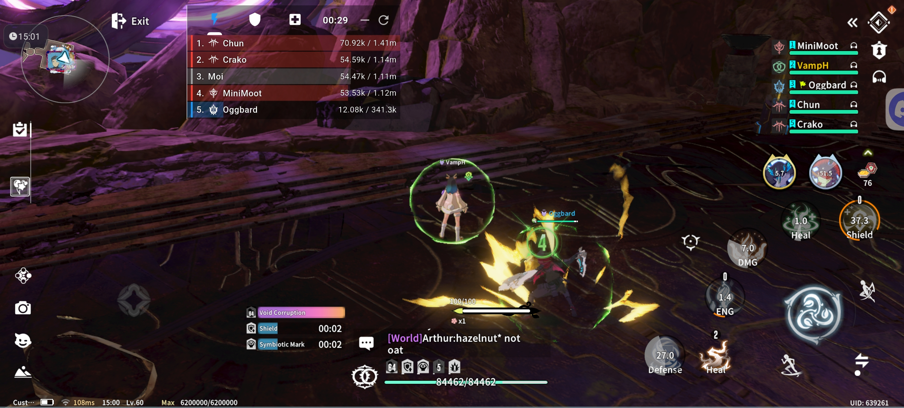
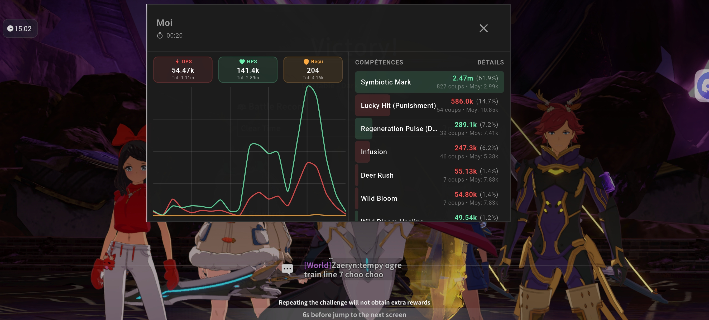
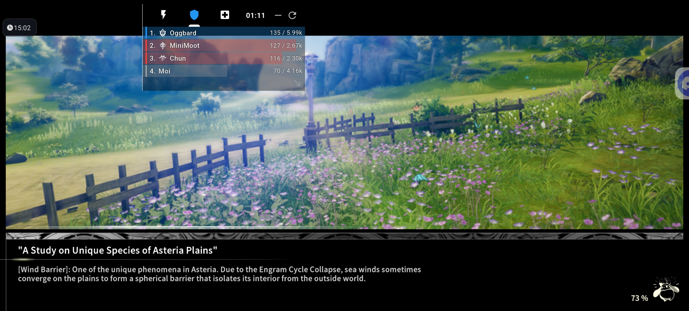
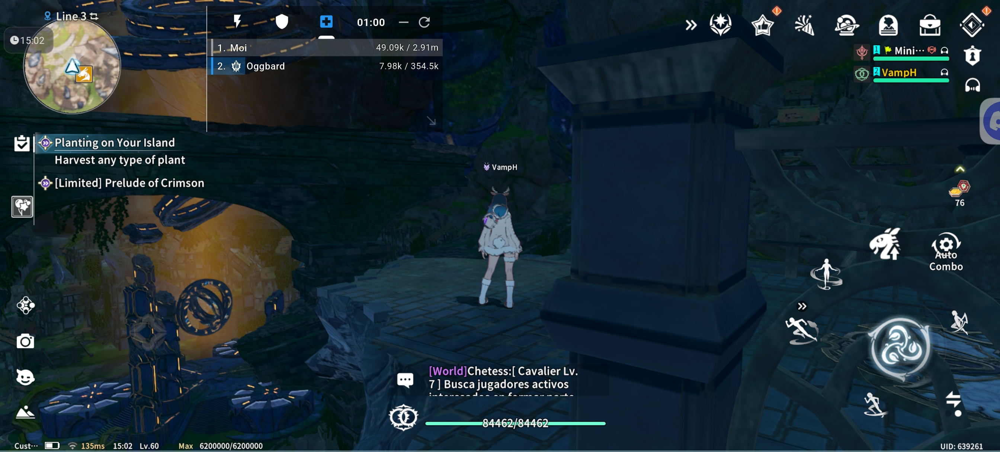

# BlueMeter — DPS Meter for Blue Protocol: Star Resonance

## Français

**Statut**
- Pré-alpha — usage expérimental. L'application est utilisable mais comporte des bugs connus.

**Description**
BlueMeter est un DPS/Heal meter mobile conçu pour le jeu "Blue Protocol - Star Resonance". Il fournit un overlay flottant (sur Android) affichant en temps réel :

- Dégâts par seconde (DPS)
- Dégâts subis par seconde
- Heal par seconde
- Totaux cumulés
- Bouton de reset pour remettre les compteurs à zéro

L'objectif est d'aider les joueurs à analyser leurs performances en combat via un affichage simple et direct.

**Plateforme**
- Compatible uniquement avec Android.
- iOS : très peu probable dans un futur proche (limites d'affichage d'overlay sur iOS).

**Fonctionnalités principales**
- Overlay flottant affichant DPS / Heal / Dégâts subis (instantané et total)
- Reset des compteurs
- Overlay minimal et peu intrusif

**Installation (développeurs / utilisateurs avancés)**
1. Cloner le dépôt et ouvrir le projet Flutter.
2. Sur macOS / Linux / Windows avec Flutter installé :

```bash
flutter build apk --release
```

3. Installer l'APK sur votre appareil Android.
4. Autoriser les permissions d'affichage par-dessus les autres applications si demandé.

**Utilisation**
- Lancer le jeu puis l'application BlueMeter.
- L'overlay devrait apparaître automatiquement si les permissions sont accordées.
- Utiliser le bouton de reset pour remettre les compteurs à zéro.

**Problèmes connus (important)**
- Parfois, certains joueurs s'affichent comme `Unknown`. Contournement : se téléporter dans le jeu puis revenir — le nom se mettra à jour.
- Déplacement de la fenêtre de l'overlay : le déplacement n'est pas stable et peut sauter ou revenir. Un redémarrage de l'app peut aider temporairement.
- L'application est en pré-alpha : attendez-vous à d'autres comportements instables ou non couverts.

**Dépannage rapide**
- Si l'overlay n'apparaît pas : vérifier les permissions "Afficher par-dessus les autres applis".
- Si des noms sont `Unknown` : téléporter/retourner dans la zone pour forcer la mise à jour.
- Si le déplacement de la fenêtre est erratique : fermer et relancer l'application.

**Contribution**
- Les contributions sont bienvenues — soumettez des issues claires et des pull requests.
- Pour les améliorations UX (stabilité du drag, gestion des noms), fournissez des étapes de reproduction et des logs si possible.

**Vie privée & Sécurité**
- L'application lit uniquement les informations nécessaires pour afficher les dégâts/soins reçus et infligés en jeu. Aucune donnée personnelle n'est collectée ni envoyée.

**Licence**
- Ce projet est sous license GNU Affero General Public License V3.

**Remerciements / Mention spéciale**
- Un grand merci au projet PC BlueMeter qui m'a été d'une grande utilité pour établir les bases de ce projet. Si vous cherchez la version PC (DPS Meter pour le même jeu), rendez-vous sur : https://github.com/caaatto/BlueMeter

**Dons / Soutien**
 - Si vous souhaitez soutenir le projet, vous pouvez m'offrir un café via PayPal : https://paypal.me/JBourny

---

## English

**Status**
- Pre-alpha — experimental use. The app is usable but contains known bugs.

**Description**
BlueMeter is a mobile DPS/Heal meter for the game "Blue Protocol - Star Resonance". It provides a floating overlay (on Android) showing in real time:

- Damage per second (DPS)
- Damage taken per second
- Heal per second
- Cumulative totals
- Reset button to zero the counters

The goal is to help players analyze combat performance with a simple, direct display.

**Platform**
- Android only.
- iOS: very unlikely in the near future (limited overlay capabilities on iOS).

**Key features**
- Floating overlay showing DPS / Heal / Damage taken (instant and total)
- Reset counters
- Minimal, unobtrusive overlay

**Installation (developers / advanced users)**
1. Clone the repository and open the Flutter project.
2. On macOS / Linux / Windows with Flutter installed:

```bash
flutter build apk --release
```

3. Install the APK on your Android device.
4. Allow the "display over other apps" permission if prompted.

**Usage**
- Start the game, then open the BlueMeter app.
- The overlay should appear automatically if permissions are granted.
- Use the reset button to zero the counters.

**Known issues (important)**
- Sometimes players appear as `Unknown`. Workaround: teleport away and return in-game — the name should update.
- Moving the floating overlay can be unstable; dragging may jump or snap back. Restarting the app can help temporarily.
- The app is in pre-alpha: expect other unstable behaviors.

**Quick troubleshooting**
- If the overlay doesn't show: check the "display over other apps" permission.
- If names are `Unknown`: teleport/return to force an update.
- If overlay dragging is erratic: close and reopen the app.

**Contributing**
- Contributions are welcome — please open clear issues and pull requests.
- For UX improvements (drag stability, name handling), include reproduction steps and logs when possible.

**Privacy & Security**
- The app only reads what is necessary to display damage/heal information from the game. No personal data is collected or transmitted.

**License**
- This project is licensed under the GNU Affero General Public License v3.

**Acknowledgements**
- Many thanks to the PC BlueMeter project which provided essential guidance for this project. If you are looking for the PC version, visit: https://github.com/caaatto/BlueMeter

**Support / Donations**
 - If you'd like to support the project, you can buy me a coffee via PayPal: https://paypal.me/JBourny

---

## Screenshots / Captures d'écran

<p float="left">
  
   
  
  
</p>

